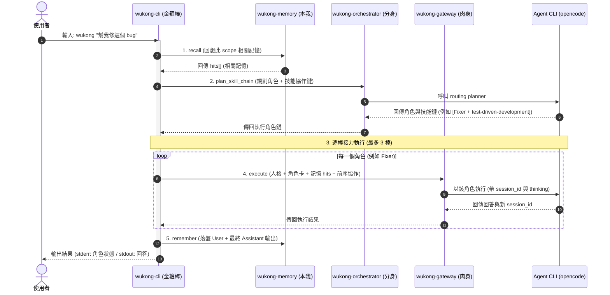

<p align="center">
  <strong>🐵 Wukong / 孫悟空</strong><br>
  全知全能的個人 AI 助手 — 有記憶、會分身、以齊天大聖之姿執行
</p>

<p align="center">
  
  
  
</p>

---

## 簡介

**Wukong** 是一個用 Rust 從零打造的個人 AI 助手，取材自中國神話的孫悟空 ——
**齊天大聖**的執行力、**七十二變**的角色分身、**鬥戰勝佛**歷劫不忘的記憶。

它把三個概念融成一個 `wukong` 指令：

> 你問一句 → 助手**回想**相關記憶 → **判斷**該用哪個專家角色 → 以**孫悟空人格 + 角色 + 記憶**驅動底層 AI agent → 回答 → 把這一回合**記下來**。

跨對話的連續性由記憶層承載，且**依工作目錄自動分專案**隔離。

本專案是 [Memoria](https://github.com/raybird)、TeleNexus、tao-of-coding 三個專案概念的 Rust 重生版。

---

## 神話對應 → 系統四柱

| 柱 | 神話身份 | crate | 職責 |
| :- | :------- | :---- | :--- |
| 1 | 鬥戰勝佛・本我 | `wukong-memory` | 持久記憶：SQLite + FTS5、keyword/tree/hybrid 召回、scope 隔離、時間衰減 |
| 2 | 齊天大聖・肉身 | `wukong-gateway` | 驅動可設定的 agent CLI、記憶注入回合（函式庫） |
| 3 | 七十二變・分身 | `wukong-orchestrator` | LLM 路由到五專家角色（Explorer/Oracle/Librarian/Fixer/Designer）並以該角色執行 |
| 4 | 修成正果・金箍棒 | `wukong-cli` → **`wukong`** | 合體：人格 + 記憶 + 角色調度於一回合，統一進入點 |

```
        wukong (金箍棒 / 統一 CLI)
        ├── 人格層（孫悟空口吻）
        ├── recall ─────────────►  wukong-memory   (本我)
        ├── route  ─────────────►  wukong-orchestrator (分身)
        ├── execute ────────────►  wukong-gateway → agent CLI (肉身)
        └── remember ───────────►  wukong-memory   (本我)
```

依賴方向（單向、無循環）：`wukong-cli → { memory, gateway, orchestrator }`，`orchestrator → gateway → memory`。

### 一回合的資料流



> 每回合對底層 agent 進行兩次呼叫（路由 + 執行）。各 crate 另有自己的 README。

### 角色協作鏈 (Collaboration Chain) 與會話隔離

- **輸入接力與前序協作**：當 planner 規劃出多角色協作鏈（例如 `explorer, fixer`）時，前一個步驟角色的輸出會被以 `[前序協作]` 格式標記，並拼接到下一步的 Task 輸入中，實現接力分析。
- **會話狀態隔離 (Session Isolation)**：為避免中間角色步驟的暫存輸出污染對話歷史，**只有最後一棒的執行才會帶入並更新該 Scope 的 `session_id`**，前面的所有輔助步驟皆為無狀態（Stateless）執行，確保最終對話的連貫與乾淨。

### 技能路由 (Skill Routing)

- **本地技能庫**：Wukong 內建 selected Superpowers 技能於 `crates/wukong-skills/assets/superpowers/`，由 `wukong-skills` catalog 以 `include_str!` 內嵌進 runtime。
- **角色 + 技能規劃**：每回合 planner 回傳最多三個步驟，每步包含角色與可選技能，例如 `fixer|test-driven-development`。
- **Prompt 注入**：執行每棒時，若技能可解析，`wukong-cli` 會把對應 `SKILL.md` 放入 `[技能規範]` 區塊，再接上人格、角色卡、記憶與任務。
- **更新來源**：使用 `scripts/sync-superpowers.sh <commit-or-tag> --dry-run` 預覽，再用 `scripts/sync-superpowers.sh <commit-or-tag>` 同步上游 Superpowers；來源版本記錄於 `crates/wukong-skills/assets/superpowers/SOURCE.md`。

---

## 快速開始

### 先決條件

- **Rust**（stable，≥ 1.96）。若未安裝：
  ```bash
  curl --proto '=https' --tlsv1.2 -sSf https://sh.rustup.rs | sh -s -- -y
  . "$HOME/.cargo/env"
  ```
- 一個可用的 **AI agent CLI**（預設 `opencode run`；可用 `--agent-cmd` 換成其他）。

### 建置與測試

```bash
cargo build            # 編譯整個 workspace
cargo test             # 全部測試（v1：63 passing）
cargo clippy --all-targets -- -D warnings
```

### 使用

```bash
# 互動 REPL（無參數）：多輪對話、session 接續、記憶持續累積
wukong
#   悟空 › 你好
#   🐵 悟空·oracle
#   ...（/exit、/quit 或 Ctrl-D 離開；/scope <x> 切換 scope）

# 基本：問一句（預設驅動 `opencode run`）
wukong "幫我重構這個函式"

# 指定底層 agent 指令
wukong --agent-cmd "opencode run" "這段程式為什麼會 panic？"

# 接續底層 agent 的上一個 session
wukong -c "那再幫我補上單元測試"

# 覆寫記憶 scope（預設依工作目錄為 project:<資料夾名>）
wukong --scope "global" "記住：我偏好 4 空格縮排"

# 關閉活動渲染（純文字一次輸出，適合管線）
wukong --no-stream "這段程式做什麼？" > out.txt

# 記憶維護（手動子命令；刪資料的操作都支援 --dry-run 預覽）
wukong memory snapshot                       # 健康快照（總數/類型/年齡/覆蓋率/候選數）
wukong memory consolidate --scope project:X  # 用 opencode 把零碎 event 聚合成 Summary
wukong memory prune --dry-run                # 預覽將刪的低價值/已摘要記憶
wukong memory export --dir ./mem-md          # 依 DB 全量重建 markdown 鏡像
```

> **活動渲染**：預設開啟，execute 以 `opencode run --format json` 即時呈現——文字到 stdout、工具活動（`▸ 使用工具 …`）到 stderr。`--no-stream` / `WUKONG_STREAM=0` 退回純文字。（opencode 目前不吐逐 token，故顆粒度為片段／步驟級而非逐字。）

每次執行會在 stderr 顯示這回合化身的角色，例如：

```
🐵 悟空·fixer
<agent 的回答…>
```

---

## CLI 參數

| 參數 | 說明 | 預設 |
| :--- | :--- | :--- |
| `[PROMPT]...` | 要問的內容（位置參數，以空白接回）；**留空則進入互動 REPL** | 選填 |
| `-c`, `--continue` | 把接續旗標透傳給底層 agent CLI | off |
| `--scope <SCOPE>` | 記憶 scope（`global` / `project:X` / `agent:X` / `user:X`） | `project:<cwd 資料夾名>` |
| `--db <URL>` | 記憶資料庫位置 | `$HOME/.wukong/memory.db` |
| `--agent-cmd <CMD>` | agent 指令（空白分隔） | `opencode run` |
| `--no-stream` | 關閉活動渲染，純文字一次輸出 | off（預設串流） |

環境變數：`WUKONG_MEMORY_DB`、`WUKONG_AGENT_CMD`、`WUKONG_AGENT_CONTINUE_ARGS`、`WUKONG_STREAM`（設 `0` 等同 `--no-stream`）、`WUKONG_MD_DIR`（設定後每次 remember 同步把記憶鏡像成 per-scope markdown）。

### 記憶維護子命令

| 子命令 | 說明 |
| :--- | :--- |
| `memory snapshot [--scope X]` | 印出健康快照：總數、依 scope/類型、年齡分佈、embedding 覆蓋率、consolidation/prune 候選數 |
| `memory consolidate [--scope X] [--dry-run]` | 把該 scope 的零碎 event/note 聚合成 `Summary`（經 opencode 摘要），來源標記為已摘要；`--dry-run` 只列批次 |
| `memory prune [--scope X] [--dry-run]` | 刪除「已被摘要」或「老舊+未取用+低重要度」的記憶；`Decision`/`Skill`/`Summary` 永不刪；`--dry-run` 只列清單 |
| `memory export [--dir D]` | 依 DB 全量重建 markdown 鏡像（DB 為唯一真相來源，markdown 單向衍生） |

### 歸檔與剪枝安全機制

- **歸檔分群規則 (Consolidation)**：執行 `consolidate` 時，系統會將擁有相同 `session_id` 的 Event/Note 記憶強制分在同一個 Batch 以維持對話脈絡；無 Session 的零碎筆記則依 `batch_size` 順序切塊。
- **安全剪枝防護 (Prune Guard)**：`prune` 操作只會安全刪除「已被歸檔 (consolidated) 的記憶」，或者是「老舊、未被召回且重要性低於閥值（預設 $< 0.5$）的 Event/Note」。**`Decision`（決策）、`Skill`（技能）與 `Summary`（摘要）這三種類型的記憶在任何情況下皆受到保護，永不被 prune 刪除。**

---

## 記憶服務（選用）

`wukong-memory` 同時提供一個獨立的 HTTP 服務 `wukong-memoryd`，供跨語言或外部工具存取：

```bash
WUKONG_MEMORY_PORT=3917 cargo run -p wukong-memoryd
curl -s http://127.0.0.1:3917/v1/health        # {"status":"ok"}
```

| Method | Path | 說明 |
| :--- | :--- | :--- |
| GET | `/v1/health` | 健康檢查 |
| GET | `/v1/stats` | 統計（總數、各 scope 分布） |
| GET | `/v1/snapshot` | 健康快照（總數/類型/年齡/embedding 覆蓋率/維護候選數） |
| POST | `/v1/remember` | 寫入記憶 |
| POST | `/v1/recall` | 召回記憶 |

回應信封：`{ data, evidence[], confidence, latency_ms }`。

---

## opencode session 控制

- 預設以**每 scope 持久的 opencode session** 接續對話(顯式 `-s <id>`,從 JSON 擷取),並帶 `--thinking`。
- `/new`:開新 context(清掉該 scope 的 session)。REPL / Telegram / Web 皆可;一次性 CLI 用 `wukong --new "…"`。
- `/compact`:把 `/compact` passthrough 給目前 session(REPL / Telegram / Web)。
- `--no-thinking` 或 `WUKONG_THINKING=0` 關閉 thinking。
- thinking 顯示:REPL 以 `💭` 印出;Telegram 在狀態泡泡即時顯示;Web 以可折疊「💭 思考過程」呈現。**只在模型吐明文推理時才有內容**(OpenAI 系推理模型的推理為加密,不會顯示)。

---

## Telegram bot（選用）

`wukong-telegram` 把對話引擎接上 Telegram:long-poll 收訊息 → 白名單過濾 → 每 chat 一個 scope（`user:tg-<id>`）→ 重用 `run_turn` → 回覆。進度為**單一狀態泡泡**(原地隨角色更新、全程 typing),完成後刪除並發答案;答案經 `wukong-render` 以 HTML 渲染(粗體/code block/表格降級)。

```bash
export WUKONG_TG_TOKEN="<BotFather token>"
export WUKONG_TG_ALLOWED="<你的 chat id>"   # 空 = 忽略所有訊息(安全預設)
cargo run -p wukong-telegram
```

`/指令` 目前回「尚未支援」,已預留分派接縫供未來加 `/reset`、`/compact`、`/model` 等。詳見 [`crates/wukong-telegram/README.md`](crates/wukong-telegram/README.md)。

---

## Web Console（選用）

`wukong-web` 是零建置的瀏覽器進入點:重用同一套 `run_turn` 與記憶,透過 SSE 串流角色進度與渲染後的答案。前端為原生 ES Modules + `<wukong-chat>` custom element(採 `raybird/plainvanillaweb` 核心慣例的 SafeHTML),由 axum 以 `include_str!` 內嵌,單一可執行檔自帶前端。

```bash
WUKONG_AGENT_CMD="opencode run" cargo run -p wukong-web
# 然後開 http://127.0.0.1:8787/
```

環境變數:

- `WUKONG_WEB_HOST`(預設 `127.0.0.1`)、`WUKONG_WEB_PORT`(預設 `8787`)
- `WUKONG_WEB_TOKEN`(選用;設了則 UI 與 `/chat` 都需帶 token)
- `WUKONG_WEB_SCOPE`(預設 `global`)
- 重用:`WUKONG_MEMORY_DB`、`WUKONG_AGENT_CMD`、`WUKONG_MD_DIR`、(feature `embed`)`WUKONG_EMBED`

安全預設:只綁 `127.0.0.1`;伺服器端 `wukong-render::to_web_html` 把原始 HTML 跳脫防 XSS。

### 執行緒隔離與 Token 安全驗證

- **非 Send Future 隔離機制**：由於對話引擎 `run_turn` 產生的 Future 內含非 `Send` 屬性（因為 `AiBackend` 包含 dynamic 的 `FnMut` 串流回呼），無法在 Axum 的異步調度中直接執行。Web 後端在處理對話請求時，會透過 `std::thread::spawn` 獨立出作業系統實體執行緒，並在內部以 `current_thread` 執行器運行 `block_on(run_turn)`，隨後將進度透過安全通道（mpsc channel）以 SSE 方式回傳。
- **Token 動態置換驗證**：若配置了 `WUKONG_WEB_TOKEN`，伺服器端在載入內嵌的 `index.html` 時，會動態將 token 置換寫入 `window.WUKONG_TOKEN` 進行 SPA 端與 API 端的雙向安全比對，以防範未授權的瀏覽器訪問。

---

## 專案結構

```
wukong/
├── Cargo.toml                      # workspace
├── crates/
│   ├── wukong-memory/              # 柱1：記憶核心（lib）
│   ├── wukong-memoryd/             # 記憶 HTTP 服務（bin）
│   ├── wukong-gateway/             # 柱2：執行閘道（lib）
│   ├── wukong-orchestrator/        # 柱3：角色調度（lib + demo bin wukong-orchestrate）
│   ├── wukong-cli/                 # 柱4：統一 CLI（lib + bin wukong）
│   ├── wukong-render/              # 渲染層：markdown → 傳輸格式（lib）
│   ├── wukong-telegram/            # 進入點：Telegram bot（lib + bin wukong-telegram）
│   └── wukong-web/                 # 進入點：Web Console（lib + bin wukong-web）
└── docs/superpowers/
    ├── specs/                      # 各柱設計 spec
    └── plans/                      # 各柱逐步實作計畫
```

---

## 記憶模型

- **儲存**：SQLite + FTS5（BM25 關鍵字檢索），啟用 WAL。 FTS5 的關鍵字匹配會將輸入的 token 以 `OR` 連接查詢。
- **召回模式**：`keyword`（FTS5）、`tree`（依 scope 階層取近期）、`hybrid`（合併重排，預設）。
- **排序**：採用混合正規化計分：
  - **Min-Max 正規化**：因 BM25（越小越好）與 Cosine 語意相似度（越大越好）量綱不同，排序前會先對所有候選人進行 Min-Max 正規化至 $[0, 1]$ 區間。
  - **權重公式**：
    $$\text{Score} = \alpha \cdot \text{Lexical} + \delta \cdot \text{Semantic} + \beta \cdot \text{Decay} + \gamma \cdot \text{Importance}$$
    （預設 $\alpha=0.4$、$\delta=0.2$、$\beta=0.25$、$\gamma=0.15$）。其中時間衰減 $\text{Decay}$ 半衰期為 90 天。
  - **對數熱點加成**：常被召回的熱點記憶會獲得對數加成：
    $$\text{Score}_{\text{final}} = \text{Score}_{\text{base}} + 0.02 \cdot \ln(1 + \text{recall\_count})$$
    同時觸發 `touch_recalled` 更新其 `last_recalled_at` 時間戳記以延緩衰減。
- **語意向量召回（選用增強層）**：cargo feature `embed` + `WUKONG_EMBED=1` 啟用本機 embedding（fastembed `all-MiniLM-L6-v2`，384 維，離線）。向量存同一 SQLite、純 Rust cosine、併入 Hybrid 綜合分；未啟用或模型載入失敗即優雅退回 BM25。既有記憶開機背景補齊。
- **Scope 階層**：`project:X` / `agent:X` / `user:X` 召回時自動含 `global`。
- **Adaptive gate**：過短／全停用詞的瑣碎查詢直接略過召回。
- **記憶維護（手動）**：`consolidation`（`Summarizer` trait 注入，預設機械串接、cli 注入 opencode 真摘要）把零碎記憶聚合成 `Summary`；`prune` 安全刪除已摘要或低價值記憶；`markdown` 雙持久化（`WUKONG_MD_DIR` 開啟、per-scope 單向鏡像）；`snapshot` 健康快照。詳見 `wukong memory <op>`。

---

## 開發

```bash
cargo test -p wukong-memory          # 單一 crate 測試
cargo test -p wukong-cli persona::   # 指定模組
cargo run -p wukong-orchestrator --bin wukong-orchestrate -- --agent-cmd "printf fixer" "fix the bug"
```

開發遵循 TDD（測試先行）、frequent commits；每一柱皆有 `docs/superpowers/specs/` 設計與 `docs/superpowers/plans/` 計畫可循。

> 提示：以 `printf fixer` 或 `echo` 當「假 agent」可在無真實 LLM 下驗證完整流程。

---

## Roadmap（v2+）

- ~~Telegram bot 進入點~~ ✅ v0.6.0;~~Web Console 進入點~~ ✅(TeleNexus 完整願景,持續)
- ~~角色協作鏈（多角色依序接力）~~ ✅ v0.5.0;~~技能路由（Superpowers 本地技能注入）~~ ✅;平行多角色調度(後續)
- ~~記憶 markdown 雙持久化、consolidation/prune、可觀測性快照~~ ✅ v0.4.0

---

## 授權

MIT
