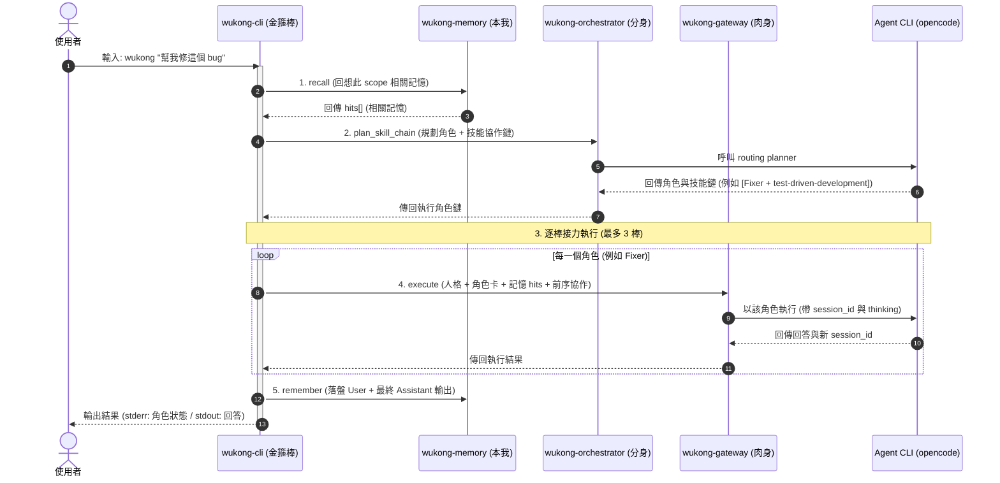

<p align="center">
  <strong>🐵 Wukong / 孫悟空</strong><br>
  全知全能的個人 AI 助手 — 有記憶、會分身、以齊天大聖之姿執行
</p>

<p align="center">
  
  
  
</p>

---

## 簡介

**Wukong** 是一個用 Rust 從零打造的個人 AI 助手，取材自中國神話的孫悟空 ——
**齊天大聖**的執行力、**七十二變**的角色分身、**鬥戰勝佛**歷劫不忘的記憶。

它把三個概念融成一個 `wukong` 指令：

> 你問一句 → 助手**回想**相關記憶 → **判斷**該用哪個專家角色 → 以**孫悟空人格 + 角色 + 記憶**驅動底層 AI agent → 回答 → 把這一回合**記下來**。

跨對話的連續性由記憶層承載，且**依工作目錄自動分專案**隔離。

本專案是 [Memoria](https://github.com/raybird)、TeleNexus、tao-of-coding 三個專案概念的 Rust 重生版。

---

## 神話對應 → 系統四柱

| 柱 | 神話身份 | crate | 職責 |
| :- | :------- | :---- | :--- |
| 1 | 鬥戰勝佛・本我 | `wukong-memory` | 持久記憶：SQLite + FTS5、keyword/tree/hybrid 召回、scope 隔離、時間衰減 |
| 2 | 齊天大聖・肉身 | `wukong-gateway` | 驅動可設定的 agent CLI、記憶注入回合（函式庫） |
| 3 | 七十二變・分身 | `wukong-orchestrator` | LLM 路由到五專家角色（Explorer/Oracle/Librarian/Fixer/Designer）並以該角色執行 |
| 4 | 修成正果・金箍棒 | `wukong-cli` → **`wukong`** | 合體：人格 + 記憶 + 角色調度於一回合，統一進入點 |

```
        wukong (金箍棒 / 統一 CLI)
        ├── 人格層（孫悟空口吻）
        ├── recall ─────────────►  wukong-memory   (本我)
        ├── route  ─────────────►  wukong-orchestrator (分身)
        ├── execute ────────────►  wukong-gateway → agent CLI (肉身)
        └── remember ───────────►  wukong-memory   (本我)
```

依賴方向（單向、無循環）：`wukong-cli → { memory, gateway, orchestrator }`，`orchestrator → gateway → memory`。

### 一回合的資料流



> 每回合對底層 agent 進行兩次呼叫（路由 + 執行）。各 crate 另有自己的 README。

### 角色協作鏈 (Collaboration Chain) 與會話隔離

- **輸入接力與前序協作**：當 planner 規劃出多角色協作鏈（例如 `explorer, fixer`）時，前一個步驟角色的輸出會被以 `[前序協作]` 格式標記，並拼接到下一步的 Task 輸入中，實現接力分析。
- **會話狀態隔離 (Session Isolation)**：為避免中間角色步驟的暫存輸出污染對話歷史，**只有最後一棒的執行才會帶入並更新該 Scope 的 `session_id`**，前面的所有輔助步驟皆為無狀態（Stateless）執行，確保最終對話的連貫與乾淨。
- **空輸出回退 (Final Output Fallback)**：末棒若為 executor、只用工具收尾而未吐文字時，`run_turn` 會回退取「最近一棒非空輸出」作為最終答覆（全空才回 `(本回合未產生文字輸出)`），保證使用者不收到空白，也不以空字串污染記憶與對話歷史。
- **末棒輸出要求**：最後一棒的 prompt 常駐注入 `[輸出要求]`（`persona::final_answer_directive`），要求即使工作都用工具完成也必須以文字總結，降低 executor 靜默收尾的機率。

### 技能路由 (Skill Routing)

- **本地技能庫**：Wukong 內建 selected Superpowers 技能於 `crates/wukong-skills/assets/superpowers/`，由 `wukong-skills` catalog 以 `include_str!` 內嵌進 runtime。
- **角色 + 技能規劃**：每回合 planner 回傳最多三個步驟，每步包含角色與可選技能，例如 `fixer|test-driven-development`。
- **Prompt 注入**：執行每棒時，若技能可解析，`wukong-cli` 會把對應 `SKILL.md` 放入 `[技能規範]` 區塊，再接上人格、角色卡、記憶與任務。
- **更新來源**：使用 `scripts/sync-superpowers.sh <commit-or-tag> --dry-run` 預覽，再用 `scripts/sync-superpowers.sh <commit-or-tag>` 同步上游 Superpowers；來源版本記錄於 `crates/wukong-skills/assets/superpowers/SOURCE.md`。

---

## 快速開始

### 先決條件

- **Rust**（stable，≥ 1.96）。若未安裝：
  ```bash
  curl --proto '=https' --tlsv1.2 -sSf https://sh.rustup.rs | sh -s -- -y
  . "$HOME/.cargo/env"
  ```
- 一個可用的 **AI agent CLI**（預設 `opencode run`；可用 `--agent-cmd` 換成其他）。

### 依情境選擇安裝模式

Wukong 提供 **Docker** 與 **Binary** 兩種安裝模式，沒有絕對的「最佳解」——請依**使用情境**選擇，因為兩者對底層 agent（opencode）的「工作範圍」與「scope 自動隔離」行為截然不同：

| 你的情境 | 建議模式 | 為什麼 |
| :--- | :--- | :--- |
| 想當作 **CLI coding 夥伴**，在各個 git 專案目錄間切換使用 | **Binary** | `wukong` 在任意目錄即開即用，opencode 直接對**真實專案檔案**動工，記憶 scope 依工作目錄自動隔離（`project:<資料夾名>`）——這是 Wukong 的核心賣點 |
| 想跑**常駐後台服務**（Telegram Bot / Web Console / Scheduler），掛在固定 workspace 上 | **Docker** | opencode config/state 隔離於 volume、不污染 host、auto-restart、UID/GID 對齊、多服務共用同一份授權 |
| 想兩者兼得 | **Binary 為主、Docker 跑常駐服務** | CLI 互動用 Binary，後台機器人用 Docker，各取所長 |

> ⚠️ 重點：**Docker 模式下 opencode 只能存取掛載進去的單一 `/workspace`**，容器內 cwd 恆為 `/workspace`，因此「依工作目錄自動分 scope」會退化成單一 scope。若你主要是在本機多個專案間做互動式開發，請選 Binary。

### 快速安裝

```bash
curl -fsSL https://raw.githubusercontent.com/raybird/Wukong/main/scripts/install.sh | bash
```

腳本會自動偵測版本，並依上表詢問你要使用哪種模式：

- **Docker mode**：在目前目錄下載 release Docker bundle，產生 `docker-compose.yml`、`.env.example`、`.env`、`Dockerfile`、entrypoint 與 workspace templates，並透過 Docker 建立隔離執行環境。Dockerfile 會下載 release binaries，不會在本機編譯 Rust。**適合常駐服務部署。**
- **Binary mode**：下載最新預編譯 binary 到 `~/.local/bin`，並以互動問答設定 Telegram / Web / 記憶等選項。**適合本機 CLI 互動開發。**

手動選項：

```bash
# 指定 Docker 模式部署到目前目錄
curl -fsSL https://raw.githubusercontent.com/raybird/Wukong/main/scripts/install.sh | bash -s -- --mode docker --version v0.14.1

# 指定 Binary 模式安裝到 ~/.local/bin
curl -fsSL https://raw.githubusercontent.com/raybird/Wukong/main/scripts/install.sh | bash -s -- --mode binary --version v0.14.1

# Linux binary mode 可選 linking flavor：
curl -fsSL ... | bash -s -- --mode binary --flavor gnu   # glibc (動態)
curl -fsSL ... | bash -s -- --mode binary --flavor musl  # musl  (靜態，預設，跨 distro)
```

### 安裝 prerelease / RC 版本

預設 installer 會查詢 GitHub Releases 的 latest stable 版本；不指定 `--version` 時，不會自動安裝 prerelease 或 RC 版本。若你要協助測試尚未正式發布的版本，請明確指定 tag。

```bash
# Docker prerelease 安裝
curl -fsSL https://raw.githubusercontent.com/raybird/Wukong/main/scripts/install.sh \
  | bash -s -- --mode docker --version v0.16.15-rc.1

# 既有 Docker 部署升級到 prerelease
curl -fsSL https://raw.githubusercontent.com/raybird/Wukong/main/scripts/install.sh \
  | bash -s -- --mode docker --upgrade --version v0.16.15-rc.1

# Binary prerelease 安裝
curl -fsSL https://raw.githubusercontent.com/raybird/Wukong/main/scripts/install.sh \
  | bash -s -- --mode binary --version v0.16.15-rc.1
```

Prerelease 適合驗證新功能或修補，例如 runtime skill assets、Docker entrypoint、binary 安裝行為等。正式部署仍建議使用 latest stable。指定 prerelease tag 時，該 GitHub Release 必須已包含完整 assets：各平台 binary tarball、對應 `checksums-<target>.txt`，以及 Docker mode 所需的 `wukong-docker-<version>.tar.gz`。

### Docker 容器化執行

提供完整的 Docker / Docker Compose 配置，隔離 host 環境，同時滿足 opencode 工作空間掛載與設定隔離需求。

**特點：**
- **Host 工作目錄掛載**：opencode 工作空間透過 volume 掛載 host 路徑
- **opencode 設定與 session 隔離**：`~/.config/opencode` 與 `~/.local/share/opencode` 都存放在 Docker volume 中，不污染 host，且可跨容器升級保留 session
- **UID/GID 對齊**：runtime user 與 host 一致，避免檔案權限問題
- **預設 Web + Telegram + Scheduler**：`docker compose up -d` 會啟動 Web Console、Telegram Bot 與排程 daemon；CLI / REPL 透過被動 `run` 使用
- **非互動權限處理**：Wukong 驅動 `opencode run` 時 stdin 永遠為空（CLI/Web/Telegram/Scheduler 皆然），opencode 無法回應互動式權限詢問。因此容器內 `WUKONG_AGENT_CMD` 預設帶 `--dangerously-skip-permissions`（自動核准詢問），並由 entrypoint 在缺檔時 seed 一份 `~/.config/opencode/opencode.json`：該旗標仍尊重 `deny` 規則，故內含一組黑名單擋下對絕對路徑的毀滅性遞迴刪除（`rm -rf /…`、`sudo rm`、家目錄等變形），同時放行 `/workspace` 內的刪除。這是 **防呆/防幻覺護欄而非資安牆**（glob 字串比對擋不住 `find -delete`、變數展開等繞法），真正的隔離邊界仍是 container 本身與 host 掛載目錄的範圍。要自訂規則，直接把你的 `opencode.json` 放進 `opencode-config` volume 即可覆蓋（缺檔才會 seed）。

### Docker 低延遲 opencode serve 模式

Docker 常駐服務預設會啟動 `opencode-server`，並讓 `wukong-web`、`wukong-telegram`、`wukong-schedulerd` 透過 `WUKONG_AGENT_SERVER_URL=http://opencode-server:4096` 呼叫同一個長壽命 `opencode serve` process。

這個模式保留 Wukong 的 scope-level session 管理，但避免每次回合都重新啟動 `opencode run`，可降低 Web、Telegram、Scheduler 等常駐入口的延遲感。

Binary 模式第一版不自動啟動或管理 `opencode serve`。在一般本機 CLI 使用情境，Wukong 仍預設透過 `opencode run` 執行，以避免背景 daemon、port、跨專案工作目錄與清理策略帶來額外複雜度。進階使用者若自行啟動 `opencode serve`，可手動設定 `WUKONG_AGENT_SERVER_URL` 使用同一 backend。

若要回到舊的 Docker CLI subprocess 模式，移除服務環境中的 `WUKONG_AGENT_SERVER_URL`，Wukong 會使用 `WUKONG_AGENT_CMD`，預設為 `opencode run --dangerously-skip-permissions`。

**快速開始：**

若你不是從 Git repository 使用，而是在空目錄部署，建議直接使用 installer：

```bash
mkdir wukong-docker && cd wukong-docker
curl -fsSL https://raw.githubusercontent.com/raybird/Wukong/main/scripts/install.sh | bash -s -- --mode docker
```

installer 會從 GitHub Release 下載 Docker bundle；bundle 內的 Dockerfile 會再下載同版本 Wukong binaries，因此不需要 Rust 或原始碼。

**升級既有 installer Docker 部署：**

若你當初是用 `install.sh --mode docker` 在空目錄產生部署檔案，請在同一個部署目錄重新下載新版 Docker bundle。`.env` 會保留；`--upgrade` 會覆蓋 bundle 內的 `docker-compose.yml`、`Dockerfile`、entrypoint 與 workspace templates。

```bash
cd /path/to/wukong-docker

curl -fsSL https://raw.githubusercontent.com/raybird/Wukong/main/scripts/install.sh \
  | bash -s -- --upgrade

docker compose build --no-cache
docker compose up -d --force-recreate
```

升級時請不要使用 `docker compose down -v`，避免刪除 `wukong-data`、`opencode-config`、`opencode-state` 等持久化 volume。若你是從舊版升級且容器還在，想盡量保留尚未持久化的 opencode session，可先備份：

```bash
docker cp wukong-telegram:/home/wukong/.local/share/opencode ./opencode-session-backup
```

從 v0.14.1 起，Docker bundle 會額外持久化 `/home/wukong/.local/share/opencode`，讓 Wukong 的 `/data/memory.db` 中 `agent_sessions` 與 opencode 本身的 session 檔案一起跨容器保留；entrypoint 也會在降權前建立並修正 `/home/wukong/.local`、`/home/wukong/.local/share/opencode`、`/home/wukong/.local/state` 權限。

若你已經在 Git repository 中，也可以直接使用隨附的 compose 檔案：

```bash
# 1. 複製環境範例（Telegram token 可稍後透過 Web 設定）
cp .env.example .env
# 可選：編輯 .env 調整 USER_ID/GROUP_ID、Web port 等

# 2. 建置並啟動 Web Console + Telegram Bot + Scheduler
docker compose up -d

# 3. 開啟 Web Console，必要時在設定區填入 Telegram bot token / allowed IDs
open http://localhost:8787/

# CLI / opencode 只在需要時被動執行
docker compose run --rm wukong opencode
docker compose run --rm wukong wukong
```

**啟用網路資訊檢索（Agent Reach + GitHub CLI）：**

Docker image 會預裝 `agent-reach` CLI 與 `gh`，但不會在 build 或 daemon 啟動時自動執行登入、Cookie 或 MCP 設定。若要讓 opencode/Wukong 具備更強的網路資訊檢索能力，請先用互動式 CLI runtime 完成一次性初始化：

```bash
docker compose run --rm wukong agent-reach install --env=auto
docker compose run --rm wukong agent-reach doctor
docker compose run --rm wukong gh auth login
docker compose up -d --force-recreate
```

請從 `wukong` CLI service 執行初始化，不要從 `wukong-web`、`wukong-telegram` 或 `wukong-schedulerd` 這類常駐服務執行互動式設定。初始化後，Agent Reach 狀態會保存在 `agent-reach-state` volume，GitHub CLI 認證會保存在 `gh-config` volume，Web、Telegram 與 Scheduler 會共用這些狀態。

部分 Agent Reach channel 需要 Cookie、Token 或平台登入態。請只在你信任的部署環境中提供這些憑證；不要把 Cookie 或 Token 寫進 `.env`，除非你明確接受該風險。若 Agent Reach 安裝流程改動了 opencode MCP 設定，請重啟相關 Docker 服務，因為 opencode 啟動後不會熱載入設定。

第一次啟動時，`wukong-telegram` 會保持待命而不是因缺少 token 重啟。開啟 Web Console 的設定區，填入 Telegram bot token 與允許的 chat/user ID 後，Telegram 服務會自動套用設定並開始 long-poll。

**自訂建構版本（可選）：**

```bash
# 指定版本（預設 v0.14.1）
docker-compose build --build-arg VERSION=v0.14.1

# 指定 target（預設 musl 靜態編譯，跨 distro 相容）
docker-compose build --build-arg TARGET=x86_64-unknown-linux-gnu  # glibc 動態連結
```

或在 `docker-compose.yml` 永久設定：
```yaml
services:
  wukong:
    build:
      args:
        VERSION: v0.14.1
        TARGET: x86_64-unknown-linux-musl
```

**AI Agent (OpenCode) 授權與多 Provider 設定：**

由於 Wukong 底層是由 `opencode` 驅動，您可以透過以下兩種方式在 Docker 環境中處理 AI 模型的授權與 Provider 設定：

*   **方法 A：互動式認證與 TUI 設定（推薦多 Provider 混合使用或 OAuth 帳號）**
    對於需要帳號驗證的服務（如 `opencode go` 雲端、GitHub Copilot）或想透過互動引導來新增 Provider（如 OpenAI、NVIDIA 等 API Key）：
    
    *   **方式一：進入 TUI 進行連線設定**
        執行以下指令開啟 `opencode` 互動視窗：
        ```bash
        docker compose run --rm wukong opencode
        ```
        進入介面後，輸入 `/connect` 並按 Enter，即可根據畫面 UI 提示選擇您的 Provider（如 NVIDIA NIM, OpenAI, Anthropic）並貼入 API Key。
        
    *   **方式二：進行 OAuth 帳號登入**
        如果使用的是官方雲端服務：
        ```bash
        docker compose run --rm wukong opencode auth login
        ```
        畫面上會顯示驗證網址與驗證碼，請在主機瀏覽器中開啟並完成登入。
    
    > [!NOTE]  
    > 以上互動式設定都會自動保存至 `opencode-config` 持久化 Volume 中。之後背景啟動 `wukong-web` 或 `wukong-telegram` 時會自動共享此授權狀態，不需重複設定。

*   **方法 B：直接透過環境變數注入（適用於 OpenAI / Anthropic / NVIDIA 等單一 API Key）**
    如果不希望手動在 UI 輸入，可以直接將 API Key 透過環境變數注入容器：
    1. 在 `.env` 中加入您的金鑰（例如 `OPENAI_API_KEY=sk-...` 或 `NVIDIA_API_KEY=nvapi-...`）。
    2. 編輯 `docker-compose.yml`，在您需要啟動的服務（如 `wukong-web`、`wukong` 等）的 `environment` 區段中加上對應的環境變數名稱（例如 `- OPENAI_API_KEY` 或 `- NVIDIA_API_KEY`），Docker Compose 即會自動載入。

**環境變數說明（.env）：**

| 變數 | 說明 | 預設 |
| :--- | :--- | :--- |
| `USER_ID` / `GROUP_ID` | 與 host 對齊的 UID/GID，避免 volume 權限問題 | `1000` |
| `WUKONG_HOST_WORKSPACE` | Host 工作目錄路徑（opencode workspace） | `./workspace` |
| `WUKONG_AGENT_CMD` | AI agent 指令（容器內預設帶 `--dangerously-skip-permissions`，見下方說明） | `opencode run --dangerously-skip-permissions` |
| `WUKONG_AGENT_SERVER_URL` | opencode serve backend URL；Docker 常駐服務預設使用，未設定時回到 `WUKONG_AGENT_CMD` | `http://opencode-server:4096` |
| `WUKONG_TG_TOKEN` | Telegram Bot Token（選用；可由 Web `/settings` 設定，env 優先） | — |
| `WUKONG_TG_ALLOWED` | 允許的 Telegram chat ID（選用；可由 Web `/settings` 設定，env 優先） | — |
| `WUKONG_WEB_HOST` / `WUKONG_WEB_PORT` | Web Console 綁定位址與埠 | `0.0.0.0:8787` |
| `WUKONG_WEB_TOKEN` | Web Console 存取密鑰（選用） | — |
| `WUKONG_THINKING` | 啟用思考過程顯示 | `1` |
| `WUKONG_EMBED` | 啟用語意向量召回 | `0` |
| `WUKONG_BIN` | 注入排程能力提示詞時使用的 `wukong` 指令路徑（agent 自行建排程時用） | `wukong` |
| `WUKONG_SCHED_NOTIFY` | schedulerd 是否把排程結果回送 Telegram（`0` 關閉） | `1` |

**Volume 架構：**

```
┌─────────────────────────────────────────────────────────┐
│  Host                      │  Container                │
├─────────────────────────────────────────────────────────┤
│  ./workspace               →  /workspace                │  (opencode 工作空間)
│  Docker Volume:            →  /home/wukong/.config/   │  (opencode 設定隔離)
│    opencode-config            opencode/                 │
│  Docker Volume:            →  /home/wukong/.local/    │  (opencode session)
│    opencode-state             share/opencode/           │
│  Docker Volume:              →  /data/                  │  (wukong 記憶資料庫與設定)
│    wukong-data                                           │
└─────────────────────────────────────────────────────────┘
```

### 從原始碼建置

如果不想用預編譯 binary，也可以直接編譯：

```bash
cargo build --release  # 編譯整個 workspace（含 wukong + wukong-telegram + wukong-web + wukong-schedulerd）
cargo test             # 全部測試
cargo clippy --all-targets -- -D warnings
```

### 使用

```bash
# 互動 REPL（無參數）：多輪對話、session 接續、記憶持續累積
wukong
#   悟空 › 你好
#   🐵 悟空·oracle
#   ...（/exit、/quit 或 Ctrl-D 離開；/scope <x> 切換 scope）

# 基本：問一句（預設驅動 `opencode run`）
wukong "幫我重構這個函式"

# 指定底層 agent 指令
wukong --agent-cmd "opencode run" "這段程式為什麼會 panic？"

# 覆寫記憶 scope（預設依工作目錄為 project:<資料夾名>）
wukong --scope "global" "記住：我偏好 4 空格縮排"

# 關閉活動渲染（純文字一次輸出，適合管線）
wukong --no-stream "這段程式做什麼？" > out.txt

# 記憶維護（手動子命令；刪資料的操作都支援 --dry-run 預覽）
wukong memory snapshot                       # 健康快照（總數/類型/年齡/覆蓋率/候選數）
wukong memory consolidate --scope project:X  # 用 opencode 把零碎 event 聚合成 Summary
wukong memory prune --dry-run                # 預覽將刪的低價值/已摘要記憶
wukong memory export --dir ./mem-md          # 依 DB 全量重建 markdown 鏡像

# 排程（Docker 模式會預設啟動 wukong-schedulerd，自動按 cron 執行）
wukong schedule add-turn \
  --name "daily project check" \
  --cron "0 9 * * 1-5" \
  --scope project:Wukong \
  --prompt "Review recent memories and suggest today's highest-impact task."

wukong schedule add-maintenance \
  --name "nightly consolidate" \
  --cron "0 2 * * *" \
  --scope project:Wukong \
  --task consolidate

wukong schedule list
wukong-schedulerd
```

> **活動渲染**：預設開啟，execute 以 `opencode run --format json` 即時呈現——文字到 stdout、工具活動（`▸ 使用工具 …`）到 stderr。`--no-stream` / `WUKONG_STREAM=0` 退回純文字。（opencode 目前不吐逐 token，故顆粒度為片段／步驟級而非逐字。）

每次執行會在 stderr 顯示這回合化身的角色，例如：

```
🐵 悟空·fixer
<agent 的回答…>
```

---

## CLI 參數

| 參數 | 說明 | 預設 |
| :--- | :--- | :--- |
| `[PROMPT]...` | 要問的內容（位置參數，以空白接回）；**留空則進入互動 REPL** | 選填 |
| `--scope <SCOPE>` | 記憶 scope（`global` / `project:X` / `agent:X` / `user:X`） | `project:<cwd 資料夾名>` |
| `--db <URL>` | 記憶資料庫位置 | `$HOME/.wukong/memory.db` |
| `--agent-cmd <CMD>` | agent 指令（空白分隔） | `opencode run` |
| `--no-stream` | 關閉活動渲染，純文字一次輸出 | off（預設串流） |

環境變數：`WUKONG_MEMORY_DB`、`WUKONG_AGENT_CMD`、`WUKONG_STREAM`（設 `0` 等同 `--no-stream`）、`WUKONG_MD_DIR`（設定後每次 remember 同步把記憶鏡像成 per-scope markdown）、`WUKONG_BIN`（注入「排程能力」提示詞時使用的 `wukong` 指令路徑，預設 `wukong`）。

### 記憶維護子命令

| 子命令 | 說明 |
| :--- | :--- |
| `memory snapshot [--scope X]` | 印出健康快照：總數、依 scope/類型、年齡分佈、embedding 覆蓋率、consolidation/prune 候選數 |
| `memory consolidate [--scope X] [--dry-run]` | 把該 scope 的零碎 event/note 聚合成 `Summary`（經 opencode 摘要），來源標記為已摘要；`--dry-run` 只列批次 |
| `memory prune [--scope X] [--dry-run]` | 刪除「已被摘要」或「老舊+未取用+低重要度」的記憶；`Decision`/`Skill`/`Summary` 永不刪；`--dry-run` 只列清單 |
| `memory export [--dir D]` | 依 DB 全量重建 markdown 鏡像（DB 為唯一真相來源，markdown 單向衍生） |

### 排程子命令

`wukong schedule` 會把排程定義存在同一個 SQLite 記憶資料庫。Cron job 由 `wukong-schedulerd` daemon 自動觸發；Docker 模式預設會啟動 daemon，`trigger` 可在沒有 daemon 的情況下立即執行單一 job。

| 子命令 | 說明 |
| :--- | :--- |
| `schedule list` | 列出所有排程 job |
| `schedule add-turn --name N --cron C --scope S --prompt P` | 新增定時 Wukong turn，執行時沿用既有 planner 自動選 role/skill |
| `schedule add-maintenance --name N --cron C --task snapshot\|consolidate\|prune [--scope S]` | 新增定時記憶維護 job |
| `schedule rm --id ID` | 刪除排程 job |
| `schedule enable --id ID` / `schedule disable --id ID` | 啟用或停用排程 job |
| `schedule trigger --id ID` | 立即執行單一 job，並記錄 run history |
| `schedule runs [--id ID] [--limit N]` | 查看最近執行紀錄 |

排程語意：

- Cron 使用 5 欄格式：`minute hour day-of-month month day-of-week`。
- V1 以 UTC 評估 cron，避免容器與 host timezone 不一致。
- 多個 daemon 同時執行時會用 DB lease claim job，避免同一輪 due job 被重複執行。
- Scheduled turn 需要底層 OpenCode provider/auth 已設定；Docker 模式會使用共用的 `opencode-config` volume。

Docker 模式下 schedulerd 預設會隨 `docker compose up -d` 啟動，讓排程功能安裝後即可運作。若你不想執行排程 daemon，可手動停止該 service：`docker compose stop wukong-schedulerd`。

### 用自然語言建立排程（Telegram / 對話）

除了手動下 `schedule add-turn`，**助手本身也知道自己具備排程能力**：每回合執行的系統提示詞會常駐注入一段「排程能力」說明（含當前 scope 與實際指令），所以你可以在 REPL / Telegram / Web 直接用自然語言交辦：

> 「每天早上九點幫我做一次專案回顧」

助手會透過底層 opencode 的 shell 能力，自行執行對應的 `wukong schedule add-turn --scope <當前 scope> --cron "0 9 * * *" --prompt "…"`（cron 由它換算）。

- **前提**：底層 agent（opencode）需具備 shell 執行權限，且 `wukong` 在其 PATH 上。若 `wukong` 不在 PATH，設定 `WUKONG_BIN=/絕對/路徑/wukong`，注入的指令會改用該路徑。
- **結果回送 Telegram**：當排程是從 Telegram 建立的（scope 形如 `user:tg-<chat_id>`），`wukong-schedulerd` 觸發後會把該回合結果**主動推回原聊天室**——成功送渲染後的 HTML、失敗送一行簡短錯誤。daemon 需設定 `WUKONG_TG_TOKEN` 才能投遞；設 `WUKONG_SCHED_NOTIFY=0` 可全域關閉。
- 投遞為 best-effort：推送失敗只記 log，不影響 job 本身的成功狀態（仍記於 `schedule runs`）。
- 共用的 Telegram 傳輸層（client + scope 解析）抽於 `wukong-tg-client` crate，由 bot 與排程 daemon 共用。

### 歸檔與剪枝安全機制

- **歸檔分群規則 (Consolidation)**：執行 `consolidate` 時，系統會將擁有相同 `session_id` 的 Event/Note 記憶強制分在同一個 Batch 以維持對話脈絡；無 Session 的零碎筆記則依 `batch_size` 順序切塊。
- **安全剪枝防護 (Prune Guard)**：`prune` 操作只會安全刪除「已被歸檔 (consolidated) 的記憶」，或者是「老舊、未被召回且重要性低於閥值（預設 $< 0.5$）的 Event/Note」。**`Decision`（決策）、`Skill`（技能）與 `Summary`（摘要）這三種類型的記憶在任何情況下皆受到保護，永不被 prune 刪除。**

---

## 記憶服務（選用）

`wukong-memory` 同時提供一個獨立的 HTTP 服務 `wukong-memoryd`，供跨語言或外部工具存取：

```bash
WUKONG_MEMORY_PORT=3917 cargo run -p wukong-memoryd
curl -s http://127.0.0.1:3917/v1/health        # {"status":"ok"}
```

| Method | Path | 說明 |
| :--- | :--- | :--- |
| GET | `/v1/health` | 健康檢查 |
| GET | `/v1/stats` | 統計（總數、各 scope 分布） |
| GET | `/v1/snapshot` | 健康快照（總數/類型/年齡/embedding 覆蓋率/維護候選數） |
| POST | `/v1/remember` | 寫入記憶 |
| POST | `/v1/recall` | 召回記憶 |

回應信封：`{ data, evidence[], confidence, latency_ms }`。

---

## opencode session 控制

- **Session 接續**：預設以**每 scope 持久的 opencode session** 接續對話（透過 `-s <id>` 顯式指定並從 JSON 擷取），並預設帶入 `--thinking` 思考過程。
- **清除上下文 (`/new`)**：在 REPL、Telegram 或 Web 輸入 `/new` 可以清空該 scope 的 session 以開啟全新對話；一次性 CLI 則可使用 `wukong --new "…"`。
- **會話壓縮 (`/compact`)**：支援將 `/compact` passthrough 給當前 session（適用於 REPL、Telegram 與 Web）。
- **停用思考過程**：使用 `--no-thinking` 參數或設定環境變數 `WUKONG_THINKING=0` 可關閉思考過程顯示。
- **思考過程顯示效果**：
  - **REPL**：以 `💭` 符號即時印出思考內容。
  - **Telegram**：在狀態泡泡中即時更新顯示。
  - **Web**：以可折疊的「💭 思考過程」區塊呈現。
  - *注意：此功能僅在模型輸出明文推理時生效（例如 OpenAI 系推理模型的推理過程如為加密傳輸則無法顯示）。*

---

## Telegram bot（選用）

`wukong-telegram` 將對話引擎無縫串接至 Telegram，其內部運作流程如下：
- **基本流程**：透過 Long-Polling 接收訊息 $\rightarrow$ 白名單過濾過後 $\rightarrow$ 依據對話群組指派獨立 Scope（`user:tg-<id>`） $\rightarrow$ 重用核心的 `run_turn` $\rightarrow$ 回覆答案。
- **即時狀態回饋**：執行期間會建立一個**單一狀態泡泡**（原地隨調度角色即時更新狀態並保持 Typing 狀態），任務完成後該狀態泡泡會自動刪除並送出最終回答。
- **格式渲染**：最終答案會經由 `wukong-render` 渲染為 Telegram 支援的 HTML 格式（支援粗體、程式碼區塊、表格自動降級呈現）。
- **建立並回送排程**：可直接用自然語言請助手建立定時任務（見〈用自然語言建立排程〉）；之後 `wukong-schedulerd` 觸發時，會把該回合結果主動推回原聊天室。傳輸層由共用的 `wukong-tg-client` crate 提供，daemon 與 bot 共用同一個 `WUKONG_TG_TOKEN`。

```bash
export WUKONG_TG_TOKEN="<BotFather token>"
export WUKONG_TG_ALLOWED="<你的 chat id>"   # 空 = 忽略所有訊息(安全預設)
cargo run -p wukong-telegram
```

`/指令` 目前回「尚未支援」，但已預留分派接縫，未來可輕鬆擴充 `/reset`、`/compact`、`/model` 等功能。詳見 [`crates/wukong-telegram/README.md`](crates/wukong-telegram/README.md)。

---

## Web Console（選用）

`wukong-web` 提供了零建置、隨開即用的瀏覽器進入點：
- **核心設計**：重用與 CLI 相同的 `run_turn` 引擎與記憶資料庫，透過 Server-Sent Events (SSE) 即時串流專家角色的執行進度與渲染後的答案。
- **前端實作**：採用原生 ES Modules 與自定義的 `<wukong-chat>` Custom Element（遵循 `raybird/plainvanillaweb` 核心慣例之 SafeHTML 設計）。
- **共享對話歷史**：Web、Telegram 與 Scheduler 共用 scope-based chat history；Web 對話頁可從來源選單切換 `Global`、`Project ...` 或 `Telegram <chat_id>`，查看同一份對話脈絡與排程推送紀錄。
- **打包部署**：所有靜態資源由 Axum 透過 `include_str!` 巨集直接內嵌於 binary 中，單一執行檔即自帶完整前端，無需額外外部部署。

```bash
WUKONG_AGENT_CMD="opencode run" cargo run -p wukong-web
# 然後開 http://127.0.0.1:8787/
```

環境變數:

- `WUKONG_WEB_HOST`(預設 `127.0.0.1`)、`WUKONG_WEB_PORT`(預設 `8787`)
- `WUKONG_WEB_TOKEN`(選用;設了則 UI 與 `/chat` 都需帶 token)
- `WUKONG_WEB_SCOPE`(預設 `global`)
- 重用:`WUKONG_MEMORY_DB`、`WUKONG_AGENT_CMD`、`WUKONG_MD_DIR`、(feature `embed`)`WUKONG_EMBED`

安全預設:只綁 `127.0.0.1`;伺服器端 `wukong-render::to_web_html` 把原始 HTML 跳脫防 XSS。

### Chat control commands

CLI/REPL、Web 與 Telegram 共用一組 allowlist 控制指令：

- `/compact`：要求 opencode 壓縮目前 scope 的 stored session。
- `/providers`：執行 `opencode providers list` 並回傳輸出。
- `/models`：執行 `opencode models` 並回傳輸出。
- `/set_models <model>`：持久化全系統預設模型，後續 Web、Telegram、Scheduler 與 CLI turns 都會套用。

未知 slash command 不會自動 passthrough 給 opencode。

### 執行緒隔離與 Token 安全驗證

- **非 Send Future 隔離機制**：由於對話引擎 `run_turn` 產生的 Future 內含非 `Send` 屬性（因為 `AiBackend` 包含 dynamic 的 `FnMut` 串流回呼），無法在 Axum 的異步調度中直接執行。Web 後端在處理對話請求時，會透過 `std::thread::spawn` 獨立出作業系統實體執行緒，並在內部以 `current_thread` 執行器運行 `block_on(run_turn)`，隨後將進度透過安全通道（mpsc channel）以 SSE 方式回傳。
- **Token 動態置換驗證**：若配置了 `WUKONG_WEB_TOKEN`，伺服器端在載入內嵌的 `index.html` 時，會動態將 token 置換寫入 `window.WUKONG_TOKEN` 進行 SPA 端與 API 端的雙向安全比對，以防範未授權的瀏覽器訪問。

---

## 專案結構

```
wukong/
├── Cargo.toml                      # workspace 設定檔
├── crates/
│   ├── wukong-memory/              # 柱1：記憶核心（lib）
│   ├── wukong-memoryd/             # 記憶 HTTP 服務（bin）
│   ├── wukong-gateway/             # 柱2：執行閘道（lib）
│   ├── wukong-orchestrator/        # 柱3：角色調度與規劃（lib + demo bin wukong-orchestrate）
│   ├── wukong-skills/              # 技能管理庫：內嵌 Superpowers 技能（lib）
│   ├── wukong-settings/            # 專案設定檔管理（lib）
│   ├── wukong-scheduler/           # 任務排程核心（lib）
│   ├── wukong-schedulerd/          # 任務排程守護行程（bin）
│   ├── wukong-runtime/             # 悟空執行時期：串聯記憶與協作鏈（lib）
│   ├── wukong-cli/                 # 柱4：統一 CLI 進入點（lib + bin wukong）
│   ├── wukong-render/              # 渲染層：markdown → HTML/Telegram HTML（lib）
│   ├── wukong-tg-client/           # Telegram 傳輸層：Bot API client + scope 解析（lib，bot/daemon 共用）
│   ├── wukong-telegram/            # 進入點：Telegram bot（lib + bin wukong-telegram）
│   └── wukong-web/                 # 進入點：Web Console（lib + bin wukong-web）
└── docs/superpowers/
    ├── specs/                      # 各模組詳細設計規格書
    └── plans/                      # 各模組逐步開發計畫
```

---

## 記憶模型

- **儲存**：SQLite + FTS5（BM25 關鍵字檢索），啟用 WAL。 FTS5 的關鍵字匹配會將輸入的 token 以 `OR` 連接查詢。
- **召回模式**：`keyword`（FTS5）、`tree`（依 scope 階層取近期）、`hybrid`（合併重排，預設）。
- **排序**：採用混合正規化計分：
  - **Min-Max 正規化**：因 BM25（越小越好）與 Cosine 語意相似度（越大越好）量綱不同，排序前會先對所有候選人進行 Min-Max 正規化至 $[0, 1]$ 區間。
  - **權重公式**：
    $$\text{Score} = \alpha \cdot \text{Lexical} + \delta \cdot \text{Semantic} + \beta \cdot \text{Decay} + \gamma \cdot \text{Importance}$$
    （預設 $\alpha=0.4$、$\delta=0.2$、$\beta=0.25$、$\gamma=0.15$）。其中時間衰減 $\text{Decay}$ 半衰期為 90 天。
  - **對數熱點加成**：常被召回的熱點記憶會獲得對數加成：
    $$\text{Score}_{\text{final}} = \text{Score}_{\text{base}} + 0.02 \cdot \ln(1 + \text{recall\_count})$$
    同時觸發 `touch_recalled` 更新其 `last_recalled_at` 時間戳記以延緩衰減。
- **語意向量召回（選用增強層）**：cargo feature `embed` + `WUKONG_EMBED=1` 啟用本機 embedding（fastembed `all-MiniLM-L6-v2`，384 維，離線）。向量存同一 SQLite、純 Rust cosine、併入 Hybrid 綜合分；未啟用或模型載入失敗即優雅退回 BM25。既有記憶開機背景補齊。
- **Scope 階層**：`project:X` / `agent:X` / `user:X` 召回時自動含 `global`。
- **Adaptive gate**：過短／全停用詞的瑣碎查詢直接略過召回。
- **記憶維護（手動）**：`consolidation`（`Summarizer` trait 注入，預設機械串接、cli 注入 opencode 真摘要）把零碎記憶聚合成 `Summary`；`prune` 安全刪除已摘要或低價值記憶；`markdown` 雙持久化（`WUKONG_MD_DIR` 開啟、per-scope 單向鏡像）；`snapshot` 健康快照。詳見 `wukong memory <op>`。

---

## 開發

```bash
cargo test -p wukong-memory          # 單一 crate 測試
cargo test -p wukong-cli persona::   # 指定模組
cargo run -p wukong-orchestrator --bin wukong-orchestrate -- --agent-cmd "printf fixer" "fix the bug"
```

開發遵循 TDD（測試先行）、frequent commits；每一柱皆有 `docs/superpowers/specs/` 設計與 `docs/superpowers/plans/` 計畫可循。

> 提示：以 `printf fixer` 或 `echo` 當「假 agent」可在無真實 LLM 下驗證完整流程。

---

## Roadmap（v2+）

- ~~Telegram bot 進入點~~ ✅ v0.6.0;~~Web Console 進入點~~ ✅(TeleNexus 完整願景,持續)
- ~~角色協作鏈（多角色依序接力）~~ ✅ v0.5.0;~~技能路由（Superpowers 本地技能注入）~~ ✅;平行多角色調度(後續)
- ~~記憶 markdown 雙持久化、consolidation/prune、可觀測性快照~~ ✅ v0.4.0
- ~~助手自然語言建立排程（提示詞注入排程能力）+ 排程結果回送 Telegram~~ ✅ 2026-06-16

---

## 授權

MIT
