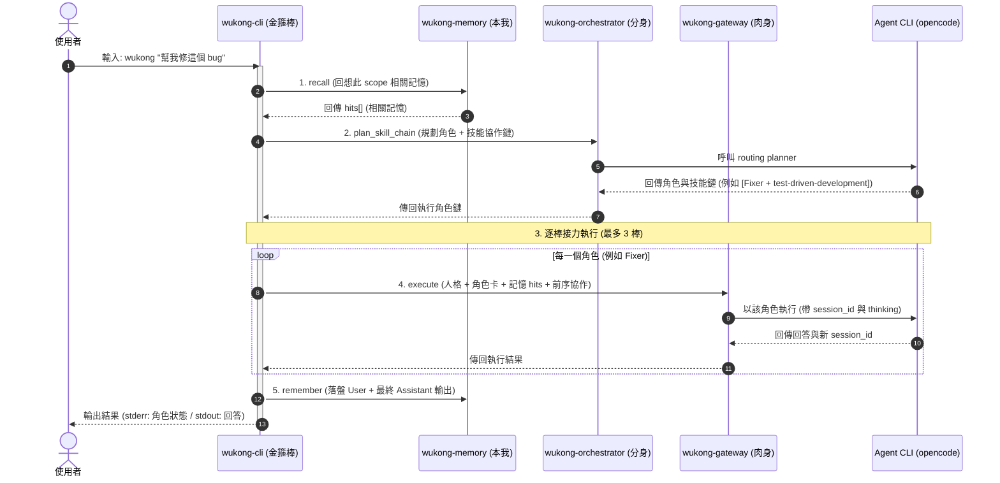

<p align="center">
  <strong>🐵 Wukong / 孫悟空</strong><br>
  全知全能的個人 AI 助手 — 有記憶、會分身、以齊天大聖之姿執行
</p>

<p align="center">
  
  
  
</p>

---

## 簡介

**Wukong** 是一個用 Rust 從零打造的個人 AI 助手，取材自中國神話的孫悟空 ——
**齊天大聖**的執行力、**七十二變**的角色分身、**鬥戰勝佛**歷劫不忘的記憶。

它把三個概念融成一個 `wukong` 指令：

> 你問一句 → 助手**回想**相關記憶 → **判斷**該用哪個專家角色 → 以**孫悟空人格 + 角色 + 記憶**驅動底層 AI agent → 回答 → 把這一回合**記下來**。

跨對話的連續性由記憶層承載，且**依工作目錄自動分專案**隔離。

本專案是 [Memoria](https://github.com/raybird)、TeleNexus、tao-of-coding 三個專案概念的 Rust 重生版。

---

## 神話對應 → 系統四柱

| 柱 | 神話身份 | crate | 職責 |
| :- | :------- | :---- | :--- |
| 1 | 鬥戰勝佛・本我 | `wukong-memory` | 持久記憶：SQLite + FTS5、keyword/tree/hybrid 召回、scope 隔離、時間衰減 |
| 2 | 齊天大聖・肉身 | `wukong-gateway` | 驅動可設定的 agent CLI、記憶注入回合（函式庫） |
| 3 | 七十二變・分身 | `wukong-orchestrator` | LLM 路由到五專家角色（Explorer/Oracle/Librarian/Fixer/Designer）並以該角色執行 |
| 4 | 修成正果・金箍棒 | `wukong-cli` → **`wukong`** | 合體：人格 + 記憶 + 角色調度於一回合，統一進入點 |

```
        wukong (金箍棒 / 統一 CLI)
        ├── 人格層（孫悟空口吻）
        ├── recall ─────────────►  wukong-memory   (本我)
        ├── route  ─────────────►  wukong-orchestrator (分身)
        ├── execute ────────────►  wukong-gateway → agent CLI (肉身)
        └── remember ───────────►  wukong-memory   (本我)
```

依賴方向（單向、無循環）：`wukong-cli → { memory, gateway, orchestrator }`，`orchestrator → gateway → memory`。

### 一回合的資料流



> 每回合對底層 agent 進行兩次呼叫（路由 + 執行）。各 crate 另有自己的 README。

### 角色協作鏈 (Collaboration Chain) 與會話隔離

- **輸入接力與前序協作**：當 planner 規劃出多角色協作鏈（例如 `explorer, fixer`）時，前一個步驟角色的輸出會被以 `[前序協作]` 格式標記，並拼接到下一步的 Task 輸入中，實現接力分析。
- **會話狀態隔離 (Session Isolation)**：為避免中間角色步驟的暫存輸出污染對話歷史，**只有最後一棒的執行才會帶入並更新該 Scope 的 `session_id`**，前面的所有輔助步驟皆為無狀態（Stateless）執行，確保最終對話的連貫與乾淨。
- **空輸出回退 (Final Output Fallback)**：末棒若為 executor、只用工具收尾而未吐文字時，`run_turn` 會回退取「最近一棒非空輸出」作為最終答覆（全空才回 `(本回合未產生文字輸出)`），保證使用者不收到空白，也不以空字串污染記憶與對話歷史。
- **末棒輸出要求**：最後一棒的 prompt 常駐注入 `[輸出要求]`（`persona::final_answer_directive`），要求即使工作都用工具完成也必須以文字總結，降低 executor 靜默收尾的機率。

### 技能路由 (Skill Routing)

- **本地技能庫**：Wukong 內建 selected Superpowers 技能於 `crates/wukong-skills/assets/superpowers/`，由 `wukong-skills` catalog 以 `include_str!` 內嵌進 runtime。
- **角色 + 技能規劃**：每回合 planner 回傳最多三個步驟，每步包含角色與可選技能，例如 `fixer|test-driven-development`。
- **Prompt 注入**：執行每棒時，若技能可解析，`wukong-cli` 會把對應 `SKILL.md` 放入 `[技能規範]` 區塊，再接上人格、角色卡、記憶與任務。
- **更新來源**：使用 `scripts/sync-superpowers.sh <commit-or-tag> --dry-run` 預覽，再用 `scripts/sync-superpowers.sh <commit-or-tag>` 同步上游 Superpowers；來源版本記錄於 `crates/wukong-skills/assets/superpowers/SOURCE.md`。

---

## 快速開始

一行安裝（腳本會詢問 Docker 或 Binary 模式，詳見 [安裝指南](docs/installation.md)）：

```bash
curl -fsSL https://raw.githubusercontent.com/raybird/Wukong/main/scripts/install.sh | bash
```

基本使用：

```bash
# 互動 REPL（無參數）：多輪對話、session 接續、記憶持續累積
wukong

# 問一句（預設驅動 `opencode run`）
wukong "幫我重構這個函式"

# 覆寫記憶 scope（預設依工作目錄為 project:<資料夾名>）
wukong --scope "global" "記住：我偏好 4 空格縮排"
```

每次執行會在 stderr 顯示這回合化身的角色，例如：

```
🐵 悟空·fixer
<agent 的回答…>
```

完整參數、記憶維護與排程子命令請見 [CLI 參考](docs/cli-reference.md)。

---

## 文件導覽

| 主題 | 文件 | 內容 |
| :--- | :--- | :--- |
| 安裝 | [docs/installation.md](docs/installation.md) | Binary / Docker 模式選擇、快速安裝、prerelease/RC、從原始碼建置 |
| Docker 部署 | [docs/docker.md](docs/docker.md) | 容器化、opencode serve 低延遲模式、升級、volume 架構、Agent Reach、provider 授權、env 變數表 |
| CLI 參考 | [docs/cli-reference.md](docs/cli-reference.md) | CLI 參數、使用範例、記憶維護子命令、排程子命令、自然語言排程、歸檔剪枝機制 |
| 記憶模型 | [docs/memory.md](docs/memory.md) | 混合計分公式、語意向量召回、scope 階層、`wukong-memoryd` HTTP API |
| 進入點 | [docs/entrypoints.md](docs/entrypoints.md) | opencode session 控制、Telegram bot、Web Console、Chat control commands、執行緒隔離 |

各 crate 另有自己的 README（見下方專案結構），`docs/superpowers/` 收錄各模組詳細設計規格書與開發計畫。

---

## 專案結構

```
wukong/
├── Cargo.toml                      # workspace 設定檔
├── crates/
│   ├── wukong-memory/              # 柱1：記憶核心（lib）
│   ├── wukong-memoryd/             # 記憶 HTTP 服務（bin）
│   ├── wukong-gateway/             # 柱2：執行閘道（lib）
│   ├── wukong-orchestrator/        # 柱3：角色調度與規劃（lib + demo bin wukong-orchestrate）
│   ├── wukong-skills/              # 技能管理庫：內嵌 Superpowers 技能（lib）
│   ├── wukong-settings/            # 專案設定檔管理（lib）
│   ├── wukong-scheduler/           # 任務排程核心（lib）
│   ├── wukong-schedulerd/          # 任務排程守護行程（bin）
│   ├── wukong-runtime/             # 悟空執行時期：串聯記憶與協作鏈（lib）
│   ├── wukong-cli/                 # 柱4：統一 CLI 進入點（lib + bin wukong）
│   ├── wukong-render/              # 渲染層：markdown → HTML/Telegram HTML（lib）
│   ├── wukong-tg-client/           # Telegram 傳輸層：Bot API client + scope 解析（lib，bot/daemon 共用）
│   ├── wukong-telegram/            # 進入點：Telegram bot（lib + bin wukong-telegram）
│   └── wukong-web/                 # 進入點：Web Console（lib + bin wukong-web）
└── docs/superpowers/
    ├── specs/                      # 各模組詳細設計規格書
    └── plans/                      # 各模組逐步開發計畫
```

---

## 開發

```bash
cargo test -p wukong-memory          # 單一 crate 測試
cargo test -p wukong-cli persona::   # 指定模組
cargo run -p wukong-orchestrator --bin wukong-orchestrate -- --agent-cmd "printf fixer" "fix the bug"
```

開發遵循 TDD（測試先行）、frequent commits；每一柱皆有 `docs/superpowers/specs/` 設計與 `docs/superpowers/plans/` 計畫可循。

> 提示：以 `printf fixer` 或 `echo` 當「假 agent」可在無真實 LLM 下驗證完整流程。

---

## Roadmap（v2+）

- ~~Telegram bot 進入點~~ ✅ v0.6.0;~~Web Console 進入點~~ ✅(TeleNexus 完整願景,持續)
- ~~角色協作鏈（多角色依序接力）~~ ✅ v0.5.0;~~技能路由（Superpowers 本地技能注入）~~ ✅;平行多角色調度(後續)
- ~~記憶 markdown 雙持久化、consolidation/prune、可觀測性快照~~ ✅ v0.4.0
- ~~助手自然語言建立排程（提示詞注入排程能力）+ 排程結果回送 Telegram~~ ✅ 2026-06-16

---

## 授權

MIT
